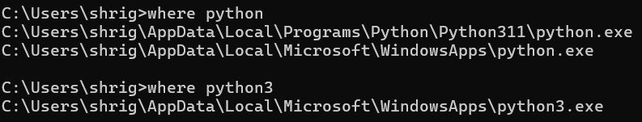
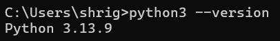
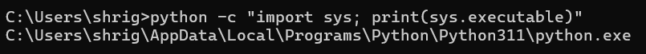
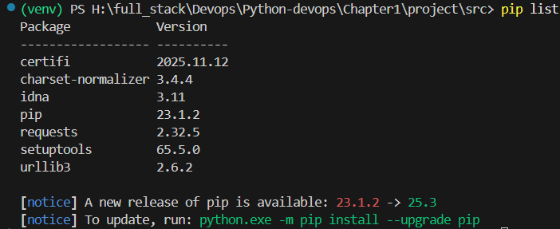
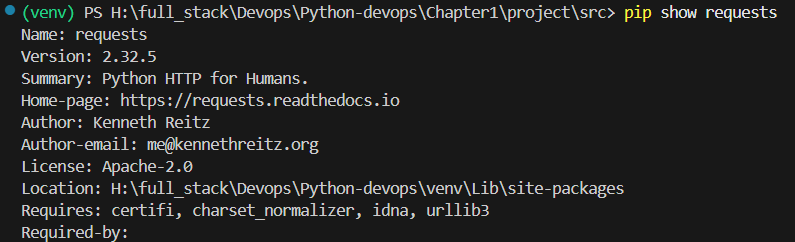

---

# 📘 CHAPTER 1 — Python Environment & Discipline (DEEP DIVE)

This chapter is about **control**.
If you can’t control your environment, **you are not DevOps** — you’re just a script runner.

---

## 1️⃣ Python Installation — What Actually Matters

### ❌ Wrong thinking

> “Python is installed, so I’m done.”

### ✅ Correct thinking

* Which Python?
* Where is it installed?
* Who uses it?
* What happens in CI / Docker / server?

### Check EXACT binary

```bash
which python
which python3
where python   # Windows
```

### Check version

```bash
python --version
python -c "import sys; print(sys.executable)"
```




You MUST know:

* Path to Python binary
* Version number
* Who owns it (system vs user)

### 1. Path to Python binary
- **Windows (CMD):**
  ```cmd
  where python
  ```
- **Linux/macOS (bash):**
  ```bash
  which python
  ```
  or
  ```bash
  command -v python
  ```

### 2. Version number
Works the same everywhere:
```bash
python --version
```
or
```bash
python -V
```

### 3. Who owns it (system vs user)
This part depends on the OS:

- **Windows:**
  ```cmd
  where python
  ```
  → If the path is under `C:\Users\<YourName>\AppData\...`, it’s a **user install**.  
  → If it’s under `C:\Program Files\...` or `C:\Windows\...`, it’s a **system install**.

- **Linux/macOS:**
  ```bash
  ls -l $(which python)
  ```
  → This shows the file owner and group.  
  Typically:
  - Owned by `root` → **system install** (via package manager).  
  - Owned by your username → **user install** (e.g., via `pyenv`, `conda`, or local build).

---




**Why DevOps cares**

* Jenkins agent may use a different Python
* Docker image may use a different Python
* Production server may not have Python at all

---

## 2️⃣ Virtual Environments — Not Optional, Ever

### What a virtual environment ACTUALLY is

A **directory** that contains:

* Its own Python binary
* Its own site-packages
* Isolated dependencies

It is NOT magic.
It is **controlled isolation**.

---

### Create venv (correct way)

```bash
python -m venv venv
```

📌 Why `python -m venv`?

* Uses the exact Python version you want
* Avoids path ambiguity

---

### Activate venv (what activation really does)

When activated:

* `python` → points to `venv/bin/python`
* `pip` → installs into venv
* `$PATH` is modified temporarily

Verify:

```bash
which python
pip --version
```

If `pip` points outside `venv` → YOU MESSED UP.

---

## 3️⃣ pip — Dependency Control, Not Toy Installer

### Install a package

```bash
pip install requests
```

### Inspect installed packages

```bash
pip list
pip show requests
```



### Freeze dependencies

```bash
pip freeze > requirements.txt
```

📌 `requirements.txt` is a **contract**

* CI uses it
* Docker uses it
* Teammates use it

If this file is missing → project is unprofessional.

---

### Rebuild environment (critical skill)

```bash
pip install -r requirements.txt
```

If this fails, your automation is fragile.

---

## 4️⃣ Project Structure — Why This Layout Exists

### Canonical structure (for now)

```
python-devops/
├── venv/               # local only, NEVER commit
├── src/
│   ├── __init__.py
│   └── main.py
├── requirements.txt
├── README.md
└── .gitignore
```

### Why `src/` exists

* Prevents import hell
* Prevents accidental global imports
* Works cleanly in CI

### Why `main.py`

* Clear entry point
* Predictable execution
* Compatible with cron, systemd, Docker

---

## 5️⃣ `__main__` Guard — This Is NOT Optional Knowledge

### Code

```python
def main():
    print("DevOps Python entry point")

if __name__ == "__main__":
    main()
```

### What this solves

* Prevents accidental execution during imports
* Allows reuse of functions
* Required for real projects

If you don’t understand this, you will write dangerous scripts later.

---

## 6️⃣ Environment Variables — First Contact

### Set env variable

**Linux/macOS**

```bash
export ENV=dev
```

**Windows**

```powershell
setx ENV dev
```

### Read in Python

```python
import os

env = os.getenv("ENV", "default")
print(env)
```

📌 This is how:

* Secrets are passed
* Config changes per environment
* CI/CD behaves differently

Hardcoding values = rookie mistake.

---

## 7️⃣ Execution Discipline — How Scripts REALLY Run

### ❌ Wrong

* Double-click `.py`
* Run from random directory
* Hardcoded paths

### ✅ Correct

```bash
python src/main.py
```

Always assume:

* Script may run from ANY directory
* Script may run inside container
* Script may run via scheduler

---

## 8️⃣ Common Beginner Mistakes (DO NOT IGNORE)

| Mistake              | Why it’s bad            |
| -------------------- | ----------------------- |
| Global pip installs  | Breaks system tools     |
| No venv              | Non-reproducible builds |
| No requirements.txt  | CI failures             |
| Hardcoded paths      | Production crashes      |
| `print()` everywhere | Untraceable logs        |

---

# 🧠 ASSIGNMENTS (MANDATORY)

### 📝 Assignment 1 — Environment Validation

Write a script `env_check.py` that prints:

* Python version
* Python executable path
* Current working directory
* Value of ENV variable

---

### 📝 Assignment 2 — Dependency Rebuild Test

1. Delete `venv`
2. Recreate it
3. Install from `requirements.txt`
4. Prove script still works

If it doesn’t → your setup is broken.

---

### 📝 Assignment 3 — Fail on Purpose

* Rename `requirements.txt`
* Try rebuilding
* Observe failure
* Restore it

Understand **why** it failed.

---

## ✅ Chapter 1 Completion Criteria (STRICT)

You may move forward ONLY if:

* You can rebuild env from scratch
* You understand `__main__`
* You can explain why venv exists
* You can read env variables
* You run scripts correctly from terminal

---

## Next (DO NOT JUMP YET)

➡ **Chapter 2 — Python Syntax (DevOps-Only)**

* Data structures that matter
* Control flow for automation
* Writing readable, safe functions

Perfect set of DevOps-style assignments, Ganesh 👌. Let’s break them down step by step so you can execute them cleanly and document the workflow in Markdown for reproducibility.

---

## 📝 Assignment 1 — Environment Validation

Create `env_check.py`:

```python
import sys
import os

def main():
    print("Python version:", sys.version)
    print("Python executable path:", sys.executable)
    print("Current working directory:", os.getcwd())
    print("ENV variable (PATH):", os.environ.get("PATH"))

if __name__ == "__main__":
    main()
```

👉 Run it with:
```bash
python env_check.py
```

This validates your interpreter, path, working directory, and environment variables.

---

## 📝 Assignment 2 — Dependency Rebuild Test

Steps:

1. **Delete venv**  
   ```bash
   rm -rf venv        # Linux/macOS
   rmdir /s /q venv   # Windows CMD
   ```

2. **Recreate venv**  
   ```bash
   python -m venv venv
   ```

3. **Activate venv**  
   - Linux/macOS:
     ```bash
     source venv/bin/activate
     ```
   - Windows CMD:
     ```cmd
     venv\Scripts\activate
     ```

4. **Install dependencies**  
   ```bash
   pip install -r requirements.txt
   ```

5. **Prove script still works**  
   ```bash
   python env_check.py
   ```

If this fails → your environment or dependency setup is broken.

---

## 📝 Assignment 3 — Fail on Purpose

1. **Rename requirements.txt**  
   ```bash
   mv requirements.txt requirements.bak   # Linux/macOS
   ren requirements.txt requirements.bak  # Windows CMD
   ```

2. **Try rebuilding**  
   ```bash
   pip install -r requirements.txt
   ```
   → This will fail because the file is missing.

3. **Restore it**  
   ```bash
   mv requirements.bak requirements.txt   # Linux/macOS
   ren requirements.bak requirements.txt  # Windows CMD
   ```

4. **Understand why it failed**  
   - Pip expects `requirements.txt` by default.  
   - Renaming breaks the dependency resolution step.  
   - Restoring fixes the workflow.

---
