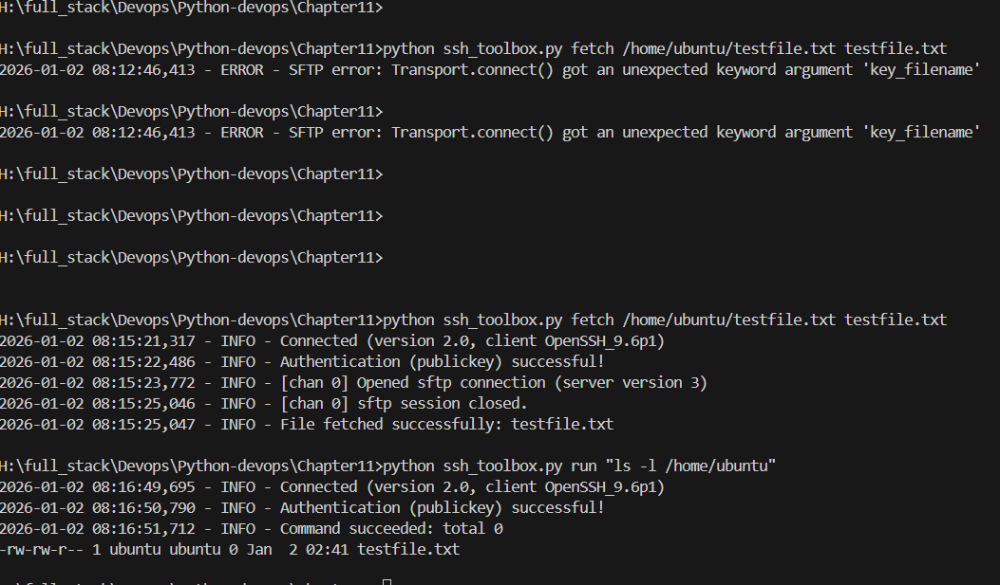

Alright Ganesh 👍, let’s take your **Chapter 11 SSH assignments** and bundle them into one **`ssh_toolbox.py`** that you can run against an **AWS EC2 instance**. I’ll also give you the **step‑wise execution guide** so you can test it end‑to‑end.

---

## 📝 Unified Script: `ssh_toolbox.py`

```python
import sys
import os
import logging
import paramiko

logging.basicConfig(level=logging.INFO,
                    format="%(asctime)s - %(levelname)s - %(message)s")
logger = logging.getLogger("SSHToolbox")

# --- Safe SSH Wrapper ---
def run_remote(host, user, key_file, command, port=22, timeout=10):
    try:
        client = paramiko.SSHClient()
        client.set_missing_host_key_policy(paramiko.AutoAddPolicy())
        client.connect(hostname=host, port=port, username=user,
                       key_filename=key_file, timeout=timeout)

        stdin, stdout, stderr = client.exec_command(command, timeout=timeout)
        exit_code = stdout.channel.recv_exit_status()

        if exit_code == 0:
            logger.info("Command succeeded: %s", stdout.read().decode().strip())
        else:
            logger.error("Command failed (%d): %s", exit_code, stderr.read().decode().strip())

        client.close()
        return exit_code
    except Exception as e:
        logger.error("SSH error: %s", e)
        return 1


# --- Assignment 1: Remote Uptime Checker ---
def uptime(host, user, key_file, port=22):
    return run_remote(host, user, key_file, "uptime", port)


# --- Assignment 2: Disk Check Over SSH ---
def disk_check(host, user, key_file, threshold=80, port=22):
    try:
        client = paramiko.SSHClient()
        client.set_missing_host_key_policy(paramiko.AutoAddPolicy())
        client.connect(hostname=host, port=port, username=user,
                       key_filename=key_file, timeout=10)

        stdin, stdout, stderr = client.exec_command("df -h /")
        exit_code = stdout.channel.recv_exit_status()
        output = stdout.read().decode().splitlines()

        if exit_code == 0 and len(output) > 1:
            usage = output[1].split()[4]  # e.g. "45%"
            percent = int(usage.strip('%'))
            logger.info("Disk usage: %d%%", percent)
            client.close()
            if percent > threshold:
                logger.error("Disk usage above threshold")
                return 1
            return 0
        else:
            logger.error("Disk check failed: %s", stderr.read().decode().strip())
            client.close()
            return exit_code
    except Exception as e:
        logger.error("SSH error: %s", e)
        return 1


# --- Assignment 3: Remote File Fetch ---
def fetch_file(host, user, key_file, remote_path, local_path, port=22):
    try:
        transport = paramiko.Transport((host, port))
        transport.connect(username=user, key_filename=key_file)
        sftp = paramiko.SFTPClient.from_transport(transport)

        sftp.get(remote_path, local_path)
        sftp.close()
        transport.close()

        if os.path.exists(local_path):
            logger.info("File fetched successfully: %s", local_path)
            return 0
        else:
            logger.error("File fetch failed: %s", local_path)
            return 1
    except Exception as e:
        logger.error("SFTP error: %s", e)
        return 1


# --- CLI Entrypoint ---
def main():
    if len(sys.argv) < 2:
        print("Usage: ssh_toolbox.py [uptime|disk|fetch|run]")
        sys.exit(2)

    cmd = sys.argv[1]

    # Adjust these for your EC2 instance
    host = "ec2-xx-xx-xx-xx.compute-1.amazonaws.com"
    user = "ubuntu"
    key_file = r"C:\Users\Ganesh\.ssh\ec2-key.pem"
    port = 22

    if cmd == "uptime":
        sys.exit(uptime(host, user, key_file, port))
    elif cmd == "disk":
        sys.exit(disk_check(host, user, key_file, 80, port))
    elif cmd == "fetch":
        if len(sys.argv) < 4:
            logger.error("Usage: ssh_toolbox.py fetch <remote_path> <local_path>")
            sys.exit(2)
        remote_path = sys.argv[2]
        local_path = sys.argv[3]
        sys.exit(fetch_file(host, user, key_file, remote_path, local_path, port))
    elif cmd == "run":
        if len(sys.argv) < 3:
            logger.error("Usage: ssh_toolbox.py run <command>")
            sys.exit(2)
        command = " ".join(sys.argv[2:])
        sys.exit(run_remote(host, user, key_file, command, port))
    else:
        logger.error("Unknown command")
        sys.exit(2)


if __name__ == "__main__":
    main()
```

---

## 🚀 Step‑Wise Execution on AWS EC2

### Step 1: Launch EC2
- Go to AWS Console → EC2 → Launch Instance.  
- Choose Ubuntu AMI.  
- Select instance type (t2.micro for testing).  
- Configure security group: allow **SSH (port 22)** from your IP.  
- Download the **key pair (.pem file)**.

---

### Step 2: Prepare EC2
- Connect manually first to test:
  ```bash
  ssh -i ec2-key.pem ubuntu@<EC2_PUBLIC_DNS>
  ```
- Ensure Python is installed on EC2 (usually preinstalled).  
- Run `uptime` and `df -h /` manually to confirm.

---

### Step 3: Prepare Host (Windows)
- Install Python + Paramiko:
  ```powershell
  pip install paramiko
  ```
- Save your `.pem` key file in `C:\Users\Ganesh\.ssh\ec2-key.pem`.  
- Ensure file permissions are correct (readable by you).

---

### Step 4: Run Toolbox
- **Check uptime:**
  ```powershell
  python ssh_toolbox.py uptime
  ```
- **Check disk usage:**
  ```powershell
  python ssh_toolbox.py disk
  ```
- **Fetch remote file:**
  ```powershell
  python ssh_toolbox.py fetch /etc/hostname hostname.txt
  ```
- **Run arbitrary command:**
  ```powershell
  python ssh_toolbox.py run "ls -l /home/ubuntu"
  ```

---

### Step 5: Verify
- Logs will show INFO/ERROR messages.  
- Exit codes: `0` success, `1` failure, `2` bad usage.  
- Check `hostname.txt` exists locally after fetch.  

---

✅ Now you have a **single CLI toolbox** that runs all four assignments against an AWS EC2 instance.  

